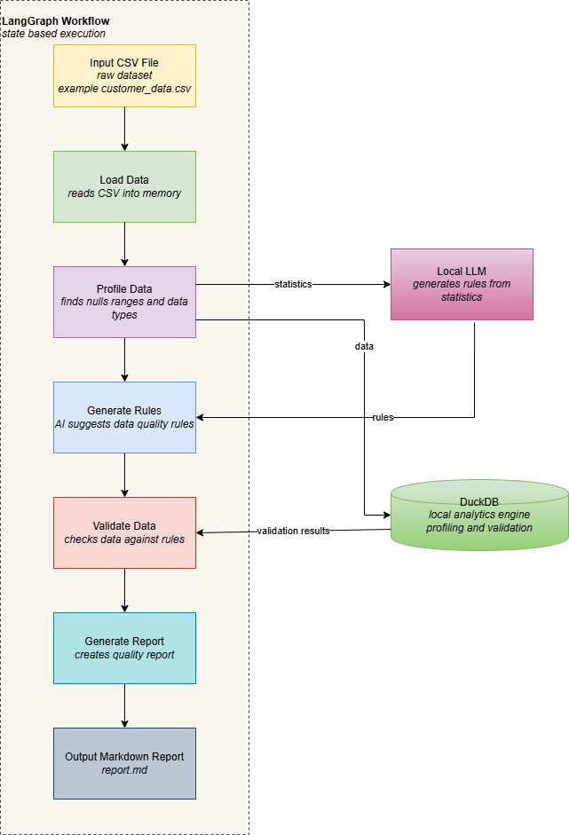

# 🐙 LangGraph Data Quality Copilot  
**Local LLM + DuckDB + LangGraph**

An AI-assisted, **local-first data quality workflow** that profiles datasets, generates validation rules, runs checks, and produces a clear, human-readable report — all without cloud APIs.

---

## 📌 What this project is

You receive a dataset — a vendor CSV, a client export, or a quick pull from S3.  
You already expect issues: missing values, duplicates, invalid ranges, or inconsistent types.

Instead of manually writing validation SQL every time, this project automates the workflow:

- Profile the dataset
- Let an AI suggest data quality rules
- Validate the data using those rules
- Generate a clear Markdown report

Everything runs **locally** using DuckDB and a local LLM (Ollama).

---

## 🏗️ Architecture Overview

This project is built as a **state-driven workflow** using LangGraph.

### Core Components

#### 1. Input CSV
- Raw dataset provided by a user or vendor  
- Example: `customer_data.csv`

#### 2. LangGraph Workflow
- Orchestrates each step as an explicit state
- Controls execution order and shared state
- Makes the pipeline deterministic and debuggable

#### 3. DuckDB
- Embedded analytical database
- Used for profiling and validation queries
- Fast, local, zero setup

#### 4. Local LLM (Ollama)
- Generates data quality rules from profiling statistics
- Runs fully offline
- No external API calls or credentials required

#### 5. Output Report
- Human-readable Markdown report
- Summarizes checks, failures, and observations  
- Example: `quality_report.md`



---

## 🔄 Workflow States (Conceptual)

Each box in the architecture diagram maps directly to a LangGraph state.

### 1. Load Data
- Reads the input CSV file
- Makes the dataset available to downstream states

### 2. Profile Data
- Computes dataset statistics such as:
  - Null counts
  - Distinct counts
  - Value ranges
  - Inferred data types

### 3. Generate Rules
- Sends profiling statistics to the local LLM
- Receives proposed data quality rules (e.g., null checks, range checks)

### 4. Validate Data
- Executes validation logic in DuckDB
- Evaluates data against generated rules

### 5. Generate Report
- Produces a Markdown report summarizing:
  - Applied rules
  - Failed checks
  - Observed data quality issues

---

## 🔁 Workflow States (Mapped)

| State              | Responsibility                              |
|--------------------|---------------------------------------------|
| Load Data          | Reads CSV into memory                       |
| Profile Data       | Computes dataset statistics                 |
| Generate Rules     | AI proposes quality rules                   |
| Validate Data      | Runs validation using DuckDB                |
| Generate Report    | Writes a Markdown quality report            |

---

## 📥 Input and 📤 Output

### Input
- `data/customer_data.csv`

### Output
- `reports/quality_report.md`

---

## 📁 Project Structure

```text
langgraph-data-quality-copilot/
│
├── data/
│   └── sample_data.csv
│
├── src/
│   ├── graph.py
│   ├── states/
│   │   ├── load_data.py
│   │   ├── profile_data.py
│   │   ├── generate_rules.py
│   │   ├── validate_data.py
│   │   └── generate_report.py
│   │
│   ├── db/
│   │   └── duckdb_client.py
│   │
│   └── llm/
│       └── ollama_client.py
│
├── reports/
│   └── quality_report.md
│
├── docs/
│   └── architecture.png
│
├── main.py
├── requirements.txt
└── README.md

---

## 🧠 Why LangGraph?

This workflow is not a single script. It is a sequence of steps with shared state.
LangGraph makes the pipeline explicit:
`load → profile → propose_rules → validate → report`
Each step is a node, state flows through the graph, and errors are captured instead of crashing the run.

---

## 🚀 Why this approach
- Rule discovery is automated
- Runs fully offline
- Easy to extend or replace components
- Useful for exploration, validation, and learning

---

## 🚫 Non-goals
- Not a production data quality platform
- Not distributed or real-time
- Not multi-user

